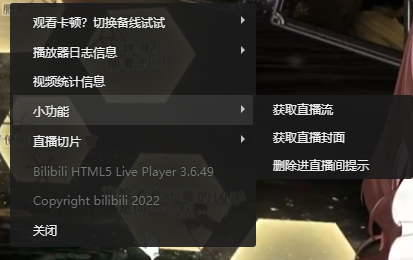

假装这是logo

<h1 align="center" dir="auto">哔哩哔哩直播小工具</h1>

  <a></img></a> </img> </img> </img>

  <a href="#功能介绍">功能介绍</a>
   
  <a href="#功能展示">功能展示</a>

# 介绍
本项目初衷是做一个直播弹幕根据屏蔽词来屏蔽内容，发现B站做过后本应直接废弃掉，但由于在发现之前加入了不少小功能，所以我仍然决定保留并开源。大家当一个小功能脚本用就好了 
<b>如果你想要查看本脚本源代码，那我还是劝你放弃吧，因为本脚本的源码包括但不限于存在以下要素：无用的变量、重复的代码、令人高血压的换行</b> 
<del><b>如果您执意要看，那请您自备好降压药</b></del>
# 教程
请确认浏览器已经安装<a href="https://www.tampermonkey.net/">油猴脚本</a>后 
<a href="https://github.com/isma123HH/bilibili_live-assistant/raw/main/build/bili_live_assistant.user.js">点我安装脚本</a> 或者前往releases自行下载导入油猴
# 功能介绍
首先说明一点，除屏蔽相关设置外，其他功能都放到了播放器的右键菜单里，所以如果你是只想用小功能，那就在播放器里面右键！
 
## 功能列表
>小功能菜单 #使用方法:右键直播显示那一块即可找到本菜单
>>获取直播流(获取实时直播流) 
>>获取直播封面(获取当前直播间的直播封面) 
>>删除进直播间提示(已计划删除，不要使用) 

>直播切片菜单(也就是直播回放流) # 选择之后会自动复制相应的回放流链接，可以粘贴至PotPlayer或其他在线网站观看
>>这里就不需要解释了吧 
>>300秒(5分钟)回放 
>>180秒(3分钟)回放 
>>60秒回放 
>>30秒回放 
>>15秒回放 

# 功能展示
## 小功能菜单
 
在播放器里右键即可查看本脚本提供的小功能，例如:<b>获取直播流</b>、<b>获取直播间封面</b>
 
## 直播切片菜单
 
### 注意！这个功能并非在每一个直播间都生效！
可以获得3分钟、1分钟、60秒、30秒、15秒的直播回放流，但是流可能`有点卡顿`

# 未来计划
## 目前的计划是在当前页面弹出新窗口(插件设置那种的窗口)显示直播回放流。

# 目前的问题
## 1.一个小问题，可能会在导致登上热门榜的窗口里显示加载成功后的提示(由于窗口太小会导致排版错乱，极其影响观看体验)，修复时间待定。
