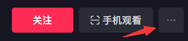

<h1 align="center" dir="auto"><del>不止哔哩哔哩</del>直播小工具</h1>

  <a></img></a> 
  </img> 
  </img> 
  </img>

  <a href="#功能介绍">功能介绍</a>
   
  <a href="#功能展示">功能展示</a>
   
  <a href="#更新列表">更新记录</a>
   
  <a href="#未来计划">未来计划</a>

# 介绍
本项目初衷是做一个直播弹幕根据屏蔽词来屏蔽内容，发现B站做过后本应直接废弃掉，但由于在发现之前加入了不少小功能，所以我仍然决定保留并开源。大家当一个小功能脚本用就好了 
<b>注意!本脚本的源码包括但不限于存在以下要素：无用的变量、重复的代码、令人高血压的换行</b> 
<b>如果您对此脚本有什么想法/意见/功能建议，请新建一个Issues！如果您想对本脚本作出贡献，可以新建一个Pull requests！我会定期查看的。</b> 
<b>小提示：本脚本已支持<a href=https://live.acfun.cn/>Acfun</a>以及<a href=https://live.douyin.com/>抖音</a>的直播流获取</b>
# 教程
请确认浏览器已经安装<a href="https://www.tampermonkey.net/">油猴脚本</a>后 
<a href="https://github.com/isma123HH/bilibili_live-assistant/raw/main/build/bili_live_assistant.user.js">点我安装脚本</a> 或者前往releases自行下载导入油猴
# 功能介绍
首先说明一点，除屏蔽相关设置外，其他功能都放到了播放器的右键菜单里，所以如果你是只想用小功能，那就在播放器里面右键！ 
还有一些没有提到的功能：<b>在每条弹幕下方标注发送时间（我觉得这个功能非常重要）</b> 
<b>以及在"分享"按钮右边显示高能榜人数，因为电脑网页这个选项是无法显示的。</b>
 
## 功能列表 最后更新与2022/5/28
>小功能菜单 #使用方法:右键直播播放器即可找到本菜单
>>获取m3u8直播流(获取格式为.m3u8格式的直播流链接) 
>>获取flv直播流(获取格式为.flv格式的直播流链接 
>>获取直播封面(获取当前直播间的直播封面) 
>><del>删除进直播间提示(已删除，这个小功能活了一个半月，很神奇吧？)</del> 

>直播切片菜单(也就是直播回放流) # 选择之后会自动复制相应的回放流链接，可以粘贴至PotPlayer或其他在线网站观看
>>这里就不需要解释了吧 
>>300秒(5分钟)回放 
>>180秒(3分钟)回放 
>>60秒回放 
>>30秒回放 
>>15秒回放 

# 功能展示
## 弹幕屏蔽
 
当检测到弹幕包含屏蔽词，则将屏蔽词变成:□
## 小功能菜单
 
在播放器里右键即可查看本脚本提供的小功能，例如:<b>获取直播流</b>、<b>获取直播间封面</b>
 
## 直播切片菜单
 
### 注意！这个功能并非在每一个直播间都生效！
可以获得3分钟、1分钟、60秒、30秒、15秒的直播回放流，但是流可能`有点卡顿`
## 直播流播放器
 
复制直播流后懒得打开网站/软件观看?我们已经内置了播放器!只需要点击"插件菜单"按钮,再点击"直播流播放器"并粘贴直播流链接即可享受在线观看! 

# 未来计划
- [x] <del>在直播间页面弹出新窗口(插件设置那种的窗口)显示直播回放流。已放弃</del> <b>已在脚本的2.5.3版本更新</b> 最后推荐一个在线网站http://tool.liumingye.cn/m3u8/index.php
- [x] <del>将"m3u8播放器"使用的video.js更换为xgplayer.js。也就是<a href=https://v2.h5player.bytedance.com/>西瓜播放器</a>，但我正在忙另一个项目，大概会在3天后更新吧</del> <b>已在2.6.0版本更新</b>
- [x] <del>"插件设置"更名为"插件菜单"，以及"m3u8播放器"更名为"直播流播放器"。同时"直播流播放器"将<b>同时支持m3u8直播流和flv直播流的播放</b></del> <b>已在2.6.3版本更新</b>
- [x] <del>支持连接当前直播间的wss，api详见<a href=https://github.com/SocialSisterYi/bilibili-API-collect/blob/master/live/message_stream.md>这里</a> <a href=https://github.com/SocialSisterYi/bilibili-API-collect/issues/360>还有这里</a></del> <b>将在2.7.0版本更新</b> 如果"直播切片"代表脚本进入了一个新时代，那这次更新代表脚本又要进入一个新时代
- [x] <del>新增一个"统计数据"的按钮，用来存放各种数据。</del>  <b>将在2.7.0版本更新</b>
- [x] <del>支持<a href=https://live.acfun.cn/>Acfun</a>的直播流获取，同样是右键播放器点击"获取直播流"。 <b>将在...2.7.0版本更新，我写这个的时候忘了发布2.7.0，所以只能带着B站wss连接更新了</b></del> 
- [x] <del>支持<a href=https://live.douyin.com/>抖音</a>的直播流获取，但不同的是需要在"手机观看"按钮旁边的里面找到直播流获取。</del> <b>依然是将在2.7.0版本更新</b>
- [ ] 陆续支持Acfun、抖音、虎牙、斗鱼等等直播平台
- [ ] 考虑更换"直播切片"菜单的接口。

# 目前的问题
- [ ] 脚本加载成功后会有提示，可能会在导致提示"恭喜主播登上热门榜"的窗口里仍然显示一次提示(该窗口太小会导致排版错乱，极其影响观看体验)
- [x] <del>切换清晰度会导致无法加载播放器，原因是切换清晰度后video标签的id会变，打开播放器需要先将原来的播放器静音。而id只会获取一次</del> <b>已在2.6.0版本解决</b>
- [ ] 在已确认可用的直播间通过"直播切片"菜单获取到的直播回放流可能无法使用，如果您也出现了这种问题，请向我反馈！
- [x] <del>在某些特殊的直播间（有特殊活动的直播间），会无法获取"直播切片"菜单内的任何切片链接，目前我只遇到了这个问题。</del> <b>在2.7.0版本解决了</b>
- [ ] 依然是某些特殊的直播间，无法获取到uid，然后就导致例如"检测弹幕是否发送成功"这个功能无法使用

# 更新列表
<ul>
<li>2022/5/21 22:47 更新脚本至2.5.3。更新内容：在"插件设置"菜单内新增了"m3u8播放器"，不需要打开其他网页即可观看直播流链接！以及删除了"删除进入直播间提示"功能</li>
<li>2022/5/21 23:37 更新脚本至2.5.4。更新内容：优化了一些代码，以及删除了"删除进入直播间提示"功能</li>
<li>2022/5/24 21:13 更新脚本至2.6.0。更新内容："m3u8播放器"原先使用video.js，在本次更新将使用<a href=https://v2.h5player.bytedance.com/>xgplayer</a>(西瓜播放器)</li>
<li>2022/5/28 18:25 更新脚本至2.6.3。更新内容：将"插件设置"改名为"插件菜单"。"m3u8播放器"改名为"直播流播放器"，以及同时支持了flv和m3u8直播流链接的播放。并修复了在某些特殊的直播间不会启用脚本的错误。<del>（但仍然无法获取直播切片 但在2.7.0版本解决了）</del></li>
<li>2022/5/31 14:53 更新脚本至2.7.0。更新内容：请前往<a href=https://github.com/isma123HH/bilibili_live-assistant/releases>release</a>查看</li>
</ul>
